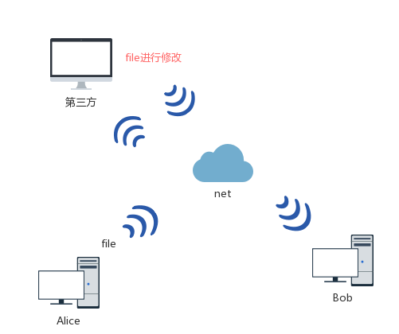
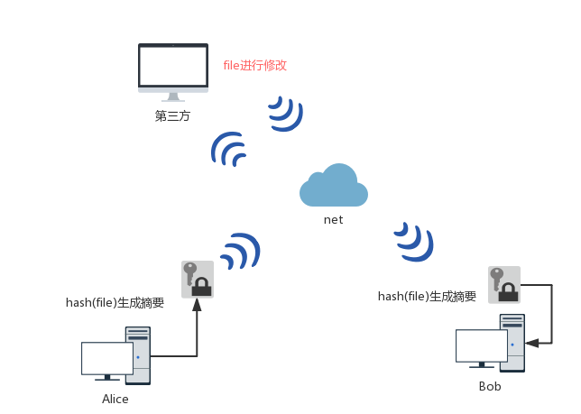

### 1. 区块链理解

#### 1.1 区块链的诞生

区块链是通过密码学的方式形成集体维护的分布式数据库

> 区块链思想最早是出在比特币中。比特币简单点讲就是去中心化的账本

##### 1.1.1 账本的发展

|阶段|时期|主要特点|
|-----|----|----|
|阶段一：简单账本|约公元前 3500 年 ~ 15 世纪|原始的单式记账法|
|阶段二：复式账本|15 世纪 ~ 20 世纪中期|现代复式记账法|
|阶段三：数字化账本|20 世纪中期 ~ 21 世纪初|物理媒介账本演化到数字化账本|
|阶段四：分布式账本|2009 年至今|区块链为代表的分布式账本相关思想和技术出现|

#### 1.1.2 账本

**简单账本:**

账本只有一个,只能保存在记账者手中,很难发现账本被篡改。

**复式账本:**
多方记账,借方和贷方进行记账,借贷双方总账时刻保持相等,但是发生纠纷以谁的账本为准

**数字化账本**
记账方法本身并没有太多创新，但由于数字媒介的出现，使得账本的规模、处理的速度、账本的复杂度，都有了天翻地覆的提升。

**分布式账本**
复式记账法虽然记录了交易的来龙去脉、不易出错，但本质上仍然是中心化模式。
2009 年 1 月，基于区块链结构的比特币网络悄然问世，它融合了现代密码学和分布式网络技术等重要成果。此后数年里，在纯分布式场景下比特币网络稳定支持了海量转账交易。这让人们开始认识到，区块链这一看似极为简洁的数据结构，居然恰好解决了分布式记账的基本需求，基于区块链结构的分布式记账技术开始大量出现。由于这些技术多以区块链结构作为其核心的账本结构，也往往被统称为区块链技术。

#### 1.1.3 分布式记账

##### 分布式账本的交易问题

**身份认证**

1. 多人可以操作账本,如何识别是哪个人进行的交易
> 电子签名,使用私钥进行签名,保证每个交易都能确认身份

    公钥和私钥加解密问题：
        1.公钥解密,私钥加密,用于数字签名身份认证,私钥加钱,公钥验签
        2.公钥加密,私钥解密,用于数据加解密数据安全

2. 可以复制同一笔交易进行进行伪造
>  可以添加时间戳

##### 分布式账本存放

1. 传统的账本存放是在中心的银行,那我们如何实现分布式账本的存放呢(去中心化)
> 使用广播的方式,每人都会有一个账本,用户如果有交易就广播到所有的节点

2. 每一个人都有一个账本,那以谁的账本为准呢,如何保证让别人相信交易呢
> 工作量证明法(让伪造账本的计算力成本高到不能接受甚至完全不可行)

3. 账本是如何防篡改的呢
> 哈希函数,线性的结构来实现

[**演示网站**](https://blockchaindemo.io/)

##### 分布式账本特点

1. 去中心化
2. 不可篡改(或者篡改成本高)
3. 解决了互信问题

#### 1.1.4 区块链技术

**基本概念**
- **交易（Transaction）**：一次对账本的操作，导致账本状态的一次改变，如添加一条转账记录；
- **区块（Block）**：记录一段时间内发生的所有交易和状态结果等，是对当前账本状态的一次共识；
- **链（Chain）**：由区块按照发生顺序串联而成，是整个账本状态变化的日志记录。

如果把区块链系统作为一个状态机，则每次交易意味着一次状态改变；生成的区块，就是参与者对其中交易导致状态改变结果的共识。

**区块链的分类**
- 公链(比特币)
- 联盟链(fabric)
- 私有链

**现有阶段的问题**

1. 交易性能问题
2. 常见的分布式系统，可以通过横向增加节点来扩展整个系统的处理能力。对于区块链网络系统来说，跟传统分布式系统不同，这个问题往往并非那么简单。实际上，大部分区块链系统的性能，很大程度上取决于单个节点的处理能力。对这些系统来说，节点需要满足 高性能、安全、稳定、硬件辅助加解密能力。
3. 数据库和存储系统。LevelDB、RocksDB 等键值数据库，具备很高的随机写和顺序读、写性能，以及相对较差的随机读的性能，被广泛应用到了区块链信息存储中。但目前来看，面向区块链的数据库技术仍然是需要突破的技术难点之一，特别是如何支持更丰富语义的操作。

**认识上的误区**

**区块链核心在于比特币？** 
> 虽说区块链的基本思想出现在比特币设计中，但发展到今日，加密货币和区块链已经俨然成为了两个不太相关的阵营。前者侧重从金融角度发掘比特币等代币的实验性意义；后者则从技术层面探讨和研究分布式账本科技可能带来的商业价值，试图拓展到更多的场景。

**区块链是一种数据库技术** 
> 虽然区块链也可以用来存储数据，但它要解决的核心问题是**多方的互信协作问题**。单纯从存储数据角度，区块链效率可能不高，一般也不推荐把大量原始数据直接放到区块链系统上。当然，现有区块链系统中大量使用了数据库技术。也有企业尝试将区块链技术引入到分布式数据库领域，解决非中心化的管理问题，如 BigchainDB。

**区块链是万能的，是颠覆性的？**
>作为融合多项已有技术而出现的事物，区块链跟现有技术体系是一脉相承的。它在解决多方合作和可信处理上向前多走了一步，但并不意味着它解决了所有问题，更不会快速颠覆大量的商业模式。很长一段时间里，区块链最适用的场景仍需不断摸索，区块链也会跟已有系统共存使用。

**区块链必然是非中心化的？非中心化的一定优于中心化设计？**
> 讨论技术的优劣必须要有场景前提，区块链也是如此。并不存在某种区块链技术能在任意场景下都优于其它方案，这也是为何目前公开链和联盟链在技术选型上存在较大差异。中心化设计具有设计简单，管理完善，性能可控的特点，但往往容错性能比较差；非中心化（多中心化）的设计可以提高容错性能，利用多方共识来降低篡改风险，但意味着设计较复杂，要付出性能代价。实际上，根据实际场景的需求，现有大部分区块链技术都介于绝对的中心化和绝对的非中心化之间，以取得不同指标上的平衡。例如公开链为了提高性能通过选择部分信任的节点来作为代表。

