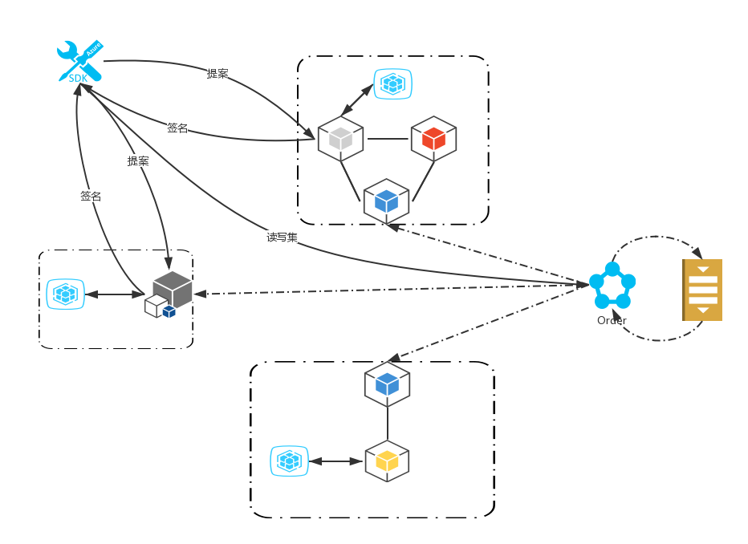

### 1.fabric peer

> peer 和order都有对应的数据库，order没有状态数据库和历史数据库

#### 1.1peer账本类型
每个peer节点会维护多个账本:
**idstore**：账本ID
**blockDB**: 实际的区块数据
**stateDB**:账本数据的最新状态，称为"世界状态"
**historyDb**:存储key的状态变化

##### 1.1.1 idstore

> 该ID数据库主要进行查询有哪些账本和创建账本恢复的作用，在创建账本的时候会往该数据库根据ID先查询一下，看看账本是否存在，如果存在则创建失败，如果不存在则在数据库中插入一条正在创建的**标识**,如果创建成功则会进行一个同时删除**标识**和往数据库中插入一个**账本ID**,如果中途发生故障，导致创建中断，当再次创建的时候会进行恢复创建。

##### 1.1.2 blockDB
账本数据是以二进制文件的形式存储的，每个账本数据存储在不同的目录下。区块文件管理器创建的文件以“blockfile_”为前缀，6位数字为后缀，后缀必须是从小到大连续的数字，中间不能有缺失。默认的区块文件大小上限是64M，一个账本能保存最大数据量大概是61TB

区块文件包含三个部分:
>BlockHeader : 
>    - 区块编号
>    - 前一个区块hash
>    - 当前区块hash
 
>BlockData  : 
>    - data 交易信息(包括读写集，channel信息chaincode , 提案，背书等)

>BlockMetadata: 
>    - Metadata (证书，公钥和签名)

[数据](https://blog.csdn.net/liu_hang_yu/article/details/78990074)

**区块索引**
在生成数据块的时候,会伴随着很多索引的创建存放在leveldb
- hash获取区块
- 区块编号获取
- 交易ID获取
  ....

##### 1.1.3 stateDB
>状态数据库,每个交易数据的有效键值对，也叫版本数据库(versionDB)

目前状态数据库支持[leveldb](https://baike.baidu.com/item/LevelDB/6416354?fr=aladdin)和[couchdb](https://baike.baidu.com/item/CouchDB/8064651?fr=aladdin),leveldb是内嵌的数据库不支持复杂查询，couchdb支持富查询，一个开源的面向文档的数据库管理系统，可以通过 RESTful API来进行访问

**状态数据库leveldb和couchdb可以相互替换不？** 
> 可以的，因为状态数据peer每次重启的时候都会以区块为准进行校验，状态数据的区块ID和区块的ID是否一致，若不一致会进行一个同步，以状态数据库的区块ID为起点进行恢复数据。

**恢复策略**:
> 因为peer拿到order发送来的区块后。落库顺序是block-> stateDb -> historyDb ，所以恢复的时候也会进行一个顺序恢复，但是stateDb的区块ID>=historyDb区块ID，会有一个分段恢复。historyDb少的单独恢复，与stateDb有交集的可以一起恢复

##### 1.1.4 historyDb
historyDb是只存key不存value的数据结构，因为historyDb存储的是一个key的所有写的操作，这个写的操作在区块中本身就有了，所以为了节省空间。索引是存在key上的找到指定区块再进行找到对应的txId的复合key，业务员设计需要historyDb的话，可以进行配置开启下

##### 1.1.5 peer类型
peer一共有3中类型:

- commit
- endorsor 
- leader

**commit**:每个节点都是commit节点，主要用来提交账本状态和落块的校验和处理
**endorsor**：对提案进行背书
**leader**: order grpc连接order 接受区块，进行对内部成员进行gossip协议分发区块 

**Leader节点选举**
leader节点是对于组织来说的,每个组织都会选举一个leader节点来进行gossip广播order广播过来的区块,然后leader节点会广播给其他区块
如果leader节点挂了，会进行选举，系统是根据pki-id的顺序来进行选举出来的，当然也可以设置leader，如果设置的情况下优先使用设置过的，当设置的leader挂了同样会根据pki-id(证书计算哈希导出(现在endpoint转换而来)的一个标识符，key pki-id value 证书的一个映射)进行选举新的leader

**Leader节点接收order节点的区块**
区块是order节点根据对应通道内的peer节点使用grpc进行一个推送给对应组织的leader节点.leader节点进行一个组织内的gossip协议广播，每个peer节点会有账本区块下一个序列号的缓存，当接到区块后会进行一个区块序号的比较，如果等于进行一个落块和更新缓存的动作，如果小于则抛弃，如果大于则缓存数据，等待连续的区块，其他节点也进行一个落块动作(每个节点都需要验证那是不是可以有其他方式)

##### 1.1.6peer节点数据一致处理

**gossip消息的使用**

1. 通道加入
2. 区块同步
3. 区块扩散
4. 删除通道组织
5. 节点存活
6. 身份消息
7. ....

**反熵(组织内部peer数据同步)**

> **反熵**: 每个节点周期性的和邻居节点进行数据校验，保证每个节点的数据块一致

每个组织中的peer节点都维护着一个该组织其他peer的列表，该列表用于节点发现和故障发现，如果所有节点的节点列表中发现leader节点没有心跳，则在一定时间内选举出来新的leader节点，leader节点会对order节点进行一个拉的动作获取未同步的区块，广播给其他peer。
同时每个peer节点会定期本地账本和其他节点账本区块序列号是否一致,来保证每个peer节点的数据一致。

peer节点和排序服务建立过多连接容易造成网络瓶颈和单点gossip可以减轻排序服务的压力

##### 1.1.7请求流程
1. client 组装提案发送给对应的背书组织的背书节点。
2. 组织对应的背书节点进行模拟执行chaincode,执行完成后对结果进行签名,返回结果给client
3. client如果是读的操作,只要收集齐一个背书就直接返回结果，不需要拼装都写集，如果是写操作(insert,update,delete)则需要进行拼装读写集发送给order节点
4. order 收到client发来的读写集,不对交易进行验证,发送给kafka,kafka分发到相应分区排序，order作为消费者,再进行根据出块配置进行出块(配置区块,还是背书区块)。通过grpc把对应的包发送给每个组织的leader节点.
5. leader节点通过gossip协议进行组织内广播,给相应的peer节点
6. peer节点收到区块后进行mvcc验证区块(多种验证),若区块无效不更新状态数据库，保留区块(不删除区块的原因可能是因为区块的hash以及生成是在order节点生成要保持order节点和peer节点保持一致)

