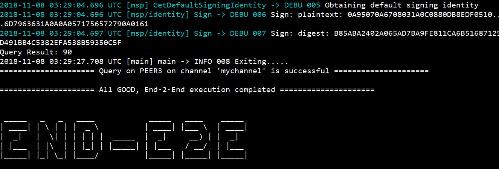

###1.官网fabric demo 运行

####1.1 环境介绍

+ 操作系统CentOS 7.3 64位,内核版本要升级为4.x以上，支持docker，具体升级[点这里](https://blog.csdn.net/kikajack/article/details/79396793)
+ 官方dome是运行在docker中的需要安装[docker](https://yeasy.gitbooks.io/docker_practice/content/install/centos.html) ,[Docker-compose](https://yeasy.gitbooks.io/docker_practice/content/compose/)
+ fabric使用go实现的还需要[go](https://studygolang.com/articles/11930?fr=sidebar)环境，gopath设置为/opt/gopath

####1.2 下载fabric源码

fabric网络搭建需要用到fabric源码中的工具包.

1. 把源码目录放到 gopath 下面.
2. 安装[git](https://www.liaoxuefeng.com/wiki/0013739516305929606dd18361248578c67b8067c8c017b000/00137396287703354d8c6c01c904c7d9ff056ae23da865a000)环境拉取源码

`````` Bash   
     sudo yum install git
``````

3. 下载源码

默认 release-1.3

`````` Bash   
     git clone https://github.com/hyperledger/fabric.git
``````

    在gopath下面创建src放源码,创建github.com/hyperledger目录把拉取的代码放入该目录下，最终目录： /opt/gopath/src/github.com/hyperledger/fabric

我这边下载的是1.0直接选择下载1.0分支

####1.3 下载fabric镜像

e2e_cli是官方的一个demo

`````` Bash   
     cd /opt/gopath/src/fabric/examples/e2e_cli
``````


下面下载镜像,使用官方提供的镜像下载脚本,前提是前面docker相关东西都已安装成功

`````` Bash   
     ./download-dockerimages.sh 
``````
下载时间可能过长

####1.4 启动e2e_cli
此模式是solo模式

`````` Bash   
     ./network_setup.sh up
``````
看到下面的为启动成功



####1.5 错误集

release-1.0:

1.  unexpected signal during runtime execution
   最大的坑阿里云 需要 在docker-compose.yaml里对peer、orderer、ca、couchdb的环境变量加入GODEBUG=netdns=go

2. the supplied identity is not valid:  x509: certificate signed by unknown authority
    一般是创世区块生成的有问题

release-1.x之后的版本官方demo占时并未启动成功,主要原因order镜像起不来，错误太多


####1.6 技巧


镜像加速下载

``````bash
    # mkdir -p /etc/docker
    # tee /etc/docker/daemon.json <<-'EOF'
    {
        "registry-mirrors": ["https://8w1wqmsz.mirror.aliyuncs.com"]
    }
    EOF
    # systemctl daemon-reload
    # systemctl restart docker
```````

